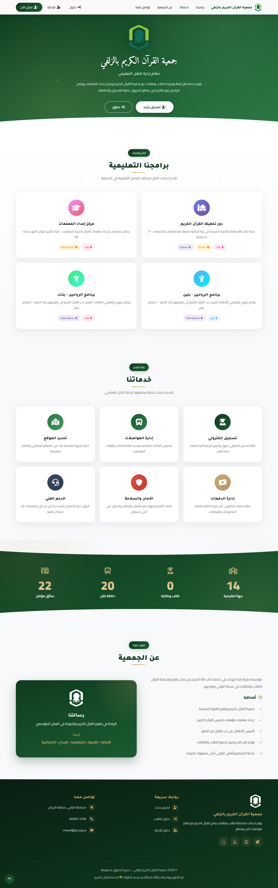

# 🚌 Rased Bus System

> نظام إدارة النقل لجمعية تحفيظ القرآن الكريم بالزلفي

[](https://rasedbus.com)
[](https://laravel.com)
[](https://php.net)
[](https://mysql.com)



## 📖 About

A comprehensive web-based transportation management system built for **Quran Memorization Association in Al-Zulfi**. The system handles daily bus operations across multiple centers, managing students, drivers, routes, and payments through an intuitive Arabic RTL interface.

🌐 **Live at:** [rasedbus.com](https://rasedbus.com)

## ✨ Features

- 👨‍🎓 **Student Management** — Registration, profile management, and bus assignments
- 🚌 **Bus & Driver System** — Track buses, drivers, and route schedules
- 🗺️ **Interactive Maps** — Visualize student locations and assign nearest pickup points
- 💳 **Payment Tracking** — Monitor subscription payments and generate reports
- 📊 **Admin Dashboard** — Real-time statistics and operational insights
- 🌙 **Arabic RTL Interface** — Fully localized for Arabic users
- 🔐 **Role-Based Access** — Separate panels for admins, supervisors, and drivers

## 🛠️ Tech Stack

- **Backend:** Laravel 10 + PHP 8.2
- **Database:** MySQL 8.0
- **Frontend:** Blade Templates + Bootstrap 5
- **Authentication:** Laravel Breeze
- **Maps:** Leaflet.js
- **Deployment:** cPanel + SSL

## 🚀 Installation

```bash
# Clone the repository
git clone https://github.com/Jarallahx/rasedbus.git
cd rasedbus

# Install dependencies
composer install
npm install

# Setup environment
cp .env.example .env
php artisan key:generate

# Configure database in .env, then run migrations
php artisan migrate --seed

# Run the application
php artisan serve
```

## 👨‍💻 Developer

**Jarallah Al-Jarallah**  
Computer Science Graduate — Majmaah University  
📧 jarallahx@gmail.com  
🔗 [LinkedIn](https://www.linkedin.com/in/jarallah-al-jarallah)

## 📝 License

This project was built as part of a co-op internship at the Quran Memorization Association in Al-Zulfi.
